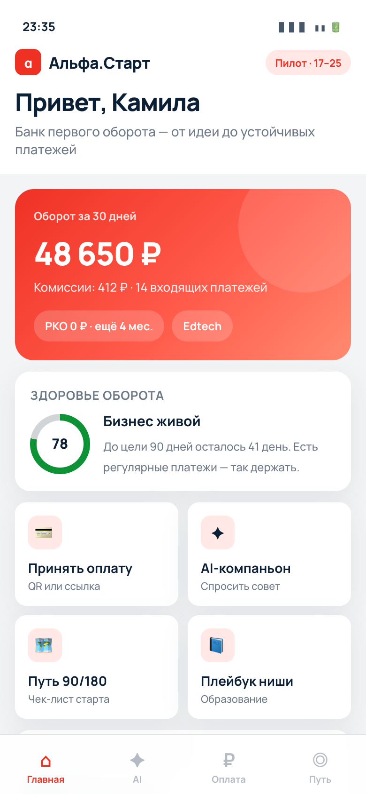

# Альфа.Старт — прототип

Интерактивный HTML-прототип сервиса **«Альфа.Старт»** для кейса Альфа-Банк / Changellenge 2026: AI-компаньон первого года бизнеса и продукты Платёжного бизнеса для предпринимателей 17–25.



## Локальный запуск

Откройте `index.html` в браузере — сервер не нужен.

Или через локальный сервер:

```bash
# Python
python3 -m http.server 8080

# Node
npx serve .
```

Затем откройте http://localhost:8080

## Экраны прототипа

| Экран | Что показывает |
|--------|----------------|
| Главная | Оборот, «Здоровье оборота», быстрые действия |
| AI | Компаньон с whitelist-сценариями и дисклеймером |
| Оплата | QR / ссылка, ниши образование · e-com · бьюти |
| Путь | Программа выживаемости 90/180 |

## Деплой на GitHub Pages

### Вариант A — через Settings (быстрее всего)

1. Создайте новый репозиторий на GitHub (например `alfa-start-prototype`).
2. Залейте эту папку:

```bash
cd alfa-start-prototype
git init
git add .
git commit -m "Add Alfa.Start prototype"
git branch -M main
git remote add origin https://github.com/<USERNAME>/alfa-start-prototype.git
git push -u origin main
```

3. На GitHub: **Settings → Pages → Build and deployment**
   - Source: **Deploy from a branch**
   - Branch: `main` / folder `/ (root)`
   - Save

4. Через 1–2 минуты сайт будет доступен:
   `https://<USERNAME>.github.io/alfa-start-prototype/`

### Вариант B — через GitHub Actions

В репозитории уже есть workflow `.github/workflows/pages.yml`.

1. Запушьте код как в варианте A.
2. **Settings → Pages → Source:** GitHub Actions.
3. Workflow задеплоит сайт автоматически при каждом push в `main`.

## Структура

```
alfa-start-prototype/
├── index.html                 # прототип (единственная страница)
├── assets/preview.png         # превью для README
├── .github/workflows/pages.yml
├── .gitignore
├── 404.html
└── README.md
```

## Технологии

- Чистый HTML / CSS / JS
- Без сборки и зависимостей
- Адаптив: рамка телефона на десктопе, fullscreen на мобиле
